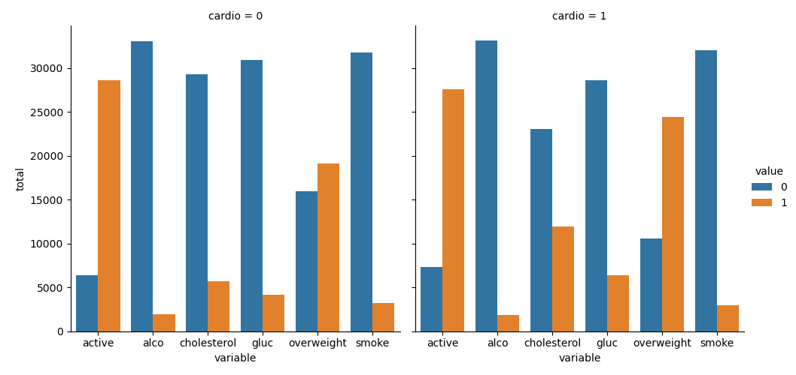
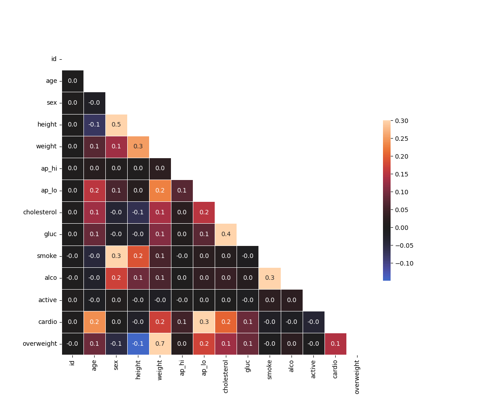

# Medical Data Visualizer

This project analyses medical examination data to identify relationships between cardiovascular disease, body measurements, blood markers, and lifestyle factors. The work was completed as part of the freeCodeCamp's [Data Analysis with Python](https://www.freecodecamp.org/learn/data-analysis-with-python/data-analysis-with-python-projects/medical-data-visualizer) course.  
It builds upon the provided starter code, with all core analysis and visualizations implemented by the author.

---

## Overview

The goal of this project is to explore potential risk indicators associated with cardiovascular disease using medical examination data. 
The analysis focuses on:
- BMI (overweight vs normal)  
- Cholesterol and glucose levels  
- Lifestyle factors (smoking, alcohol, physical activity)

Visual insights are generated through **categorical bar plots** and **correlation heatmaps**.

---

## Skills & Tools

Python | Pandas | NumPy | Matplotlib | Seaborn | Data Cleaning | Feature Engineering | Exploratory Data Analysis (EDA)

---

## Files

- `medical_data_visualizer.py` — data processing and plotting  
- `main.py` — run project  
- `test_module.py` — automated tests  
- `requirements.txt` — project dependencies  
- `medical_examination.csv` — dataset
- `catplot.png`, `heatmap.png` — example outputs

---

## Visualizations

### Categorical Plot

Shows counts of categorical features (cholesterol, glucose, smoking, alcohol, physical activity, overweight) split by cardiovascular disease.

### Correlation Heatmap

Displays correlations between all features after cleaning the dataset.

---

## Key insights
- Overweight status and cholesterol levels show noticeable differences between patients with and without cardiovascular disease, making them potentially relevant risk indicators.
- The group with cardiovascular disease contains approximately twice as many individuals with high cholesterol compared to the group without the disease. 
- Among patients without cardiovascular disease, the proportion of overweight individuals is relatively balanced, while in the group with the disease the prevalence of overweight individuals is significantly higher.  
- Diastolic blood pressure (ap_lo) shows the strongest linear association with cardiovascular disease (correlation 0.3). 
- Age, weight and cholesterol demonstrate moderate positive correlations (0.2) with cardiovascular disease. 
